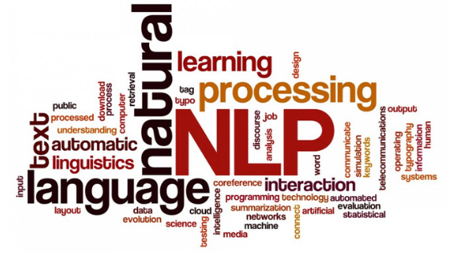

# NLP AI - Natural Language Processing with Artificial Intelligence

## Table of Contents

1. [Introduction](#introduction)
2. [Understanding NLP](#understanding-nlp)
    1. [Definition](#definition)
    2. [Applications](#applications)
3. [NLP AI Techniques](#nlp-ai-techniques)
    1. [Tokenization](#tokenization)
    2. [Part-of-Speech Tagging](#part-of-speech-tagging)
    3. [Named Entity Recognition (NER)](#named-entity-recognition)
    4. [Sentiment Analysis](#sentiment-analysis)
    5. [Machine Translation](#machine-translation)
4. [NLP AI Models](#nlp-ai-models)
    1. [Rule-Based Models](#rule-based-models)
    2. [Statistical Models](#statistical-models)
    3. [Deep Learning Models](#deep-learning-models)
5. [Challenges in NLP AI](#challenges-in-nlp-ai)
6. [Version History](#version-history)
7. [Conclusion](#conclusion)

## 1. Introduction 

Natural Language Processing (NLP) is a branch of artificial intelligence that focuses on enabling machines to understand, interpret, and generate human language. NLP AI systems have become crucial in various applications due to their ability to process and analyze vast amounts of textual data.

## 2. Understanding NLP 

### 2.1 Definition 

NLP AI is the field of study that combines linguistics, computer science, and AI to create algorithms and models that allow machines to interact with human language.

### 2.2 Applications 

NLP AI has found applications in several areas, including:

- Virtual Assistants (e.g., Siri, Alexa)
- Sentiment Analysis in Social Media
- Machine Translation
- Chatbots and Conversational AI
- Information Retrieval and Text Mining

## 3. NLP AI Techniques 

### 3.1 Tokenization 

Tokenization is the process of breaking down a text into smaller units, known as tokens. These tokens can be words, phrases, or even individual characters, depending on the level of granularity required.

### 3.2 Part-of-Speech Tagging 

Part-of-Speech (POS) tagging involves labeling each word in a sentence with its corresponding part of speech, such as noun, verb, adjective, etc.

### 3.3 Named Entity Recognition (NER) 

NER is a technique that identifies and classifies named entities (e.g., names of persons, organizations, locations) in a text.

### 3.4 Sentiment Analysis 

Sentiment analysis determines the emotional tone of a piece of text, indicating whether it's positive, negative, or neutral.

### 3.5 Machine Translation 

Machine translation uses NLP AI models to automatically translate text from one language to another.

## 4. NLP AI Models 

### 4.1 Rule-Based Models 

Rule-based models use predefined linguistic rules to process and understand natural language.

### 4.2 Statistical Models 

Statistical models utilize probabilistic methods to analyze language data and make predictions.

### 4.3 Deep Learning Models 

Deep learning models, particularly neural networks, have revolutionized NLP AI by achieving state-of-the-art results in various tasks.

## 5. Challenges in NLP AI 

NLP AI faces several challenges, including:

- Ambiguity in Language
- Contextual Understanding
- Handling Out-of-Vocabulary Words
- Cross-lingual NLP
- Ethical Considerations

## 6. Version History 

| Version | Date       | Author           | Changes Made                    |
| ------- | ---------- | ---------------- | -------------------------------- |
| 1.0     | 2023-08-02 | Mollyappa    | Initial creation of the document |
| 1.1     | 2023-08-03 | Mollyappa      | Added images and revised content |
| 1.2     | 2023-08-04 | Mollyappa      | Incorporated feedback from peers |

## 7. Conclusion 

NLP AI plays a vital role in enabling machines to understand and interact with human language. As technology continues to advance, NLP AI models and techniques will become even more powerful, opening up new possibilities and applications in various domains.