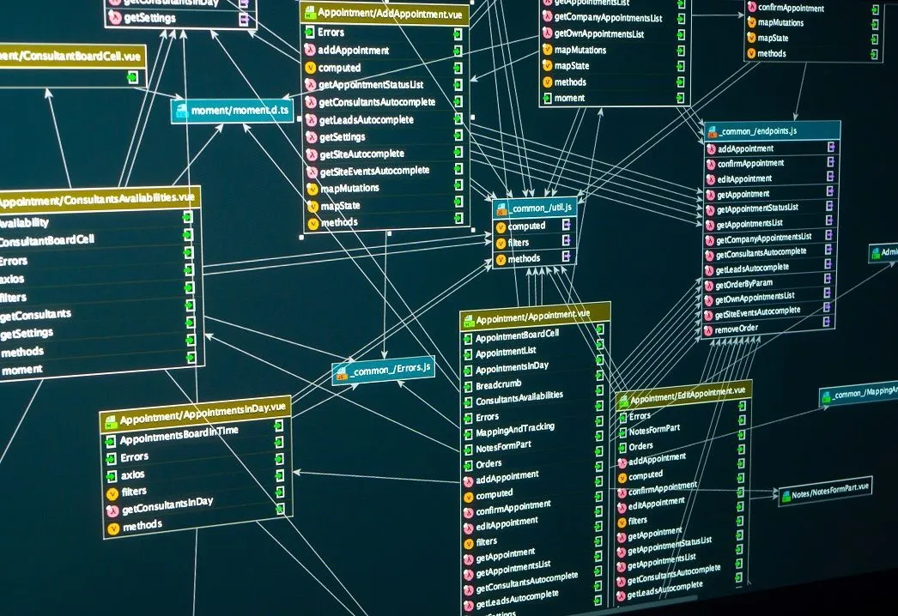

# Introduction to SQL

## What is SQL?

SQL, which stands for Structured Query Language, is a powerful programming language used to manage and interact with relational databases. It was first developed by IBM in the 1970s and has since become the standard language for working with databases.

## How Does SQL Work?

SQL allows users to perform a wide range of operations on a database, such as creating, updating, and deleting records, as well as retrieving and manipulating data. It uses a declarative approach, where users define what they want to do, and the database management system takes care of how to do it.




## Basic SQL Commands

Here are some of the fundamental SQL commands:

### 1. SELECT

The `SELECT` statement is used to retrieve data from one or more database tables. It allows you to specify the columns you want to retrieve and apply filters to narrow down the results.

```sql
SELECT column1, column2
FROM table_name
WHERE condition;
```

### 2. INSERT

The `INSERT` statement is used to add new records to a table.

```sql
INSERT INTO table_name (column1, column2, ...)
VALUES (value1, value2, ...);
```

### 3. UPDATE

The `UPDATE` statement is used to modify existing records in a table.

```sql
UPDATE table_name
SET column1 = value1, column2 = value2, ...
WHERE condition;
```

### 4. DELETE

The `DELETE` statement is used to remove records from a table.

```sql
DELETE FROM table_name
WHERE condition;
```

### 5. CREATE TABLE

The `CREATE TABLE` statement is used to create a new table in the database.

```sql
CREATE TABLE table_name (
    column1 datatype constraint,
    column2 datatype constraint,
    ...
);
```

### 6. DROP TABLE

The `DROP TABLE` statement is used to delete an existing table and its data from the database.

```sql
DROP TABLE table_name;
```

## Advanced SQL Concepts

SQL also supports more advanced concepts such as:

### 1. Joins

Joins allow you to combine data from multiple tables based on a related column.

```sql
SELECT column1, column2
FROM table1
JOIN table2 ON table1.column = table2.column;
```

### 2. Aggregation

SQL provides functions like `SUM`, `AVG`, `COUNT`, etc., to perform calculations on groups of data.

```sql
SELECT department, SUM(salary) AS total_salary
FROM employees
GROUP BY department;
```

### 3. Subqueries

Subqueries are queries embedded within other queries, allowing you to perform complex operations.

```sql
SELECT name, department
FROM employees
WHERE department IN (SELECT department FROM managers);
```

## Conclusion

SQL is a crucial language for anyone dealing with relational databases. It offers a versatile set of commands and features, allowing users to manage, retrieve, and manipulate data efficiently. Whether you are a beginner or an experienced database administrator, SQL is an essential skill to master in the world of data management.